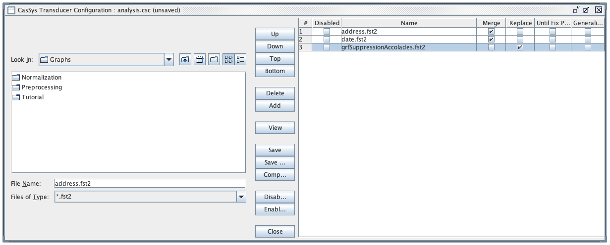

This [zip file](CasSys+Graphs.zip) contains an example (`Tutorial` directory) with Unitex CasSys cascades and their graphs.
It contains the two CasSys cascades (`analysis` and `synthesis`). 
The synthesis cascade is generic and can be used in any project. 
The analysis cascade is specific and contains two graphs `address.grf` and `date.grf`.
These two graphs are just simple examples to show how to build transducers and cascades and add annotation on text.

## Directory structure

The Unitex path directory should have the following structure:

* `Unitex-GramLab-3.2/{language}/CasSys/{project-name}/analysis.csc`
* `Unitex-GramLab-3.2/{language}/CasSys/{project-name}/synthesis.csc`
* `Unitex-GramLab-3.2/{language}/Graphs/{project-name}/analysis/`
* `Unitex-GramLab-3.2/{language}/Graphs/{project-name}/synthesis/`

## Re-use in your own project

You must copy the `CasSys/Tutorial/synthesis.csc` CasSys cascade file and the `Graphs/Tutorial/synthesis/` folder from the downloaded zip in you own project directory: 

> Unitex-GramLab-3.2/{language}/CasSys/{project-name}/synthesis.csc
> Unitex-GramLab-3.2/{language}/Graphs/{project-name}/synthesis/*

Then, you can build you own analysis cascade by adding new graphs in the `Graphs/{project-name}/analysis/` folder and by editing the `CasSys/{project-name}/analysis.csc` file.

## Warnings

* Make sure to change the project name in the graph paths in the `synthesis.csc` file.
* Make sure to add the `synthesis/grfSuppressionAccolades.fst2` graph at the end of the `analysis` cascade.

