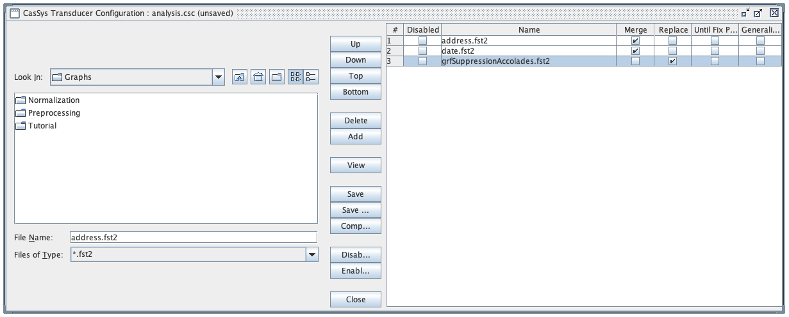

1. [Tutorial_CasSys+Graphs.zip](Tutorial_CasSys+Graphs.zip)
The [Tutorial_CasSys+Graphs.zip](Tutorial_CasSys+Graphs.zip) contains an example (`Tutorial` directory) with Unitex CasSys cascades and their graphs.
It contains the two CasSys cascades (`analysis` and `synthesis`). 
The analysis cascade is specific and contains two graphs `address.grf` and `date.grf`, which are used to illustrate how you can build graphs for the annotatation of addresses and dates in text.
The synthesis cascade is generic and can be used in any project. 
These two graphs are just simple examples to show how to build transducers and cascades and add annotation on text.
You can consult the Unitex/GramLab documentation for more information on how to build graphs and cascades: [https://unitexgramlab.org/releases/3.2/man/Unitex-GramLab-3.2-usermanual-en.pdf](https://unitexgramlab.org/releases/3.2/man/Unitex-GramLab-3.2-usermanual-en.pdf)

2. [Blank-project_CasSys+Graphs.zip](Blank-project_CasSys+Graphs.zip)

The [Blank-project_CasSys+Graphs.zip](Blank-project_CasSys+Graphs.zip) contains a blank project (`project-name` directory) with a blank `analysis` cascade (.csc) containing only the `synthesis/grfSuppressionAccolades.fst2` graph (see Warnings section below). It also contains the generic `synthesis` cascade and its graphs.

## Directory structure

The Unitex path directory should have the following structure:

* `{unitex-directory}/{language}/CasSys/{project-name}/analysis.csc`
* `{unitex-directory}/{language}/CasSys/{project-name}/synthesis.csc`
* `{unitex-directory}/{language}/Graphs/{project-name}/analysis/`
* `{unitex-directory}/{language}/Graphs/{project-name}/synthesis/`

## Re-use in your own project

You must copy the `CasSys/project-name/synthesis.csc` CasSys cascade file and the `Graphs/project-name/synthesis/` folder from [Blank-project_CasSys+Graphs.zip](Blank-project_CasSys+Graphs.zip) in you own project directory: 

> {unitex-directory}/{language}/**CasSys**/{project-name}/**synthesis.csc**

> {unitex-directory}/{language}/**Graphs**/{project-name}/**synthesis/\***

Then, unsing the Unitex/GramLab software you can build you own analysis cascade by adding new graphs in the `Graphs/{project-name}/analysis/` folder and by editing the `CasSys/{project-name}/analysis.csc` file.

## Warnings

* Make sure to change the project name in the graph paths in the `synthesis.csc` file.
* Make sure to add the `synthesis/grfSuppressionAccolades.fst2` graph at the end of the `analysis` cascade (and select 'Replace' mode).

